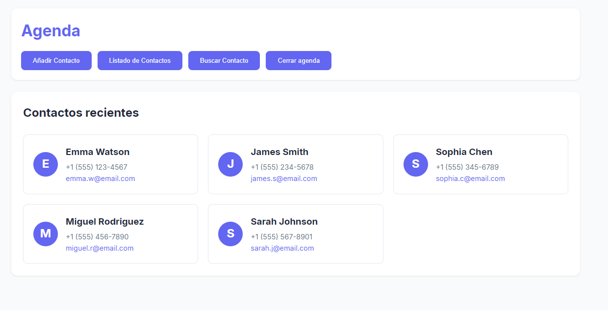

# Agenda



### Prerequisites

- Node.js (v14 or higher)
- npm or yarn

### Installation

1. Clone the repository:
```bash
git clone https://github.com/luisda190519/Prueba-evolveOps
```

2. Install dependencies:
```bash
npm install
```

3. Start the development server:
```bash
npm run dev
```

4. Open your browser and visit `http://localhost:5173`

## Usage

### Main Features

1. **Recent Contacts**
   - View your 5 most recently added contacts
   - Quick access to contact details
   - Edit contacts directly from the dashboard

2. **Add New Contacts**
   - Click "Add Contact" in the menu
   - Fill in the contact details (name, phone, email)
   - Submit to save the new contact

3. **View All Contacts**
   - Access the complete contact list
   - Contacts are sorted alphabetically
   - Edit any contact with a single click

4. **Search Contacts**
   - Use the search function to find specific contacts
   - Search by name or email
   - Real-time search results

5. **Edit Contacts**
   - Click the edit button on any contact card
   - Update contact information
   - Changes are saved immediately


## Contact

Luis Daniel - [@luisda190519](https://github.com/luisda190519)
